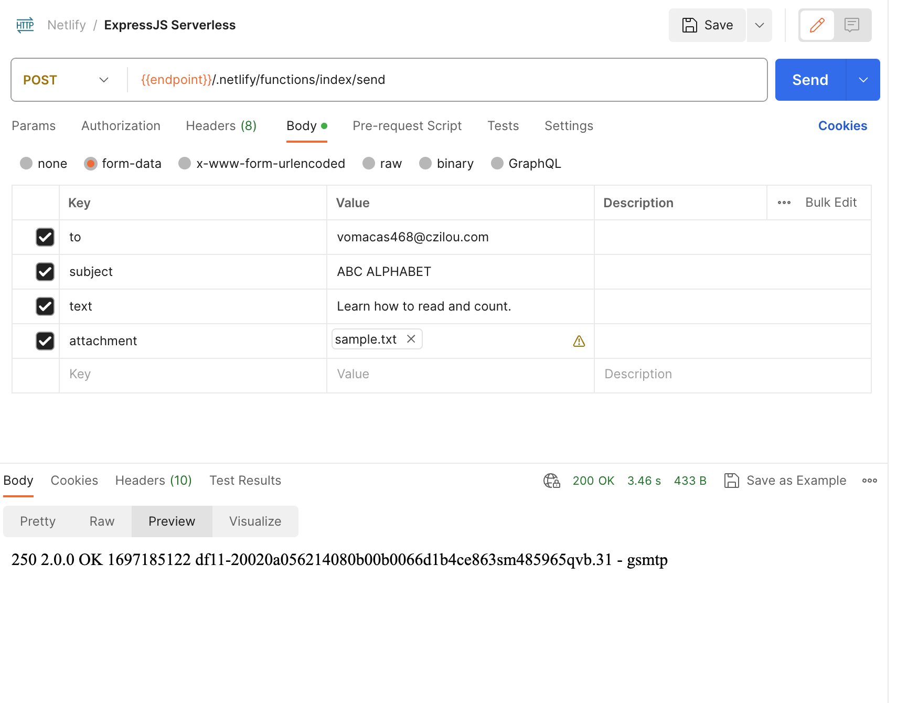

# Serverless SMTP Gmail sender 

## Overview

Provides a working setup for Netlify Function to deploy a backend (ExpressJS) that can perform simple smtp transactions using GMAIL SMTP and with attachment.

## Prerequisites

Before you begin, ensure you have met the following requirements:

- In your Netlify project, make sure to setup your environment variables for the following keys
    - email - Your Google Email
    - password - Your App Password generated when activating 2 Factor Auth for Google(not the Google password)
- Node.js and npm (preferably v18 and above) installed on your local machine.
- Install and perform build. (This will ask you to login to your Netlify account during build)
    
    ```bash
    npm install
    npm run build
    ```


## API Request
- Http Method: POST
- Body Type: Form



### Using Curl
```sh
curl --location 'https://<netlify-endpoint>/.netlify/functions/index/send' \
--form 'to="user@mail.com"' \
--form 'subject="Subject"' \
--form 'text="Message' \
--form 'attachment=@"/path/to/yourfile.txt"'
```